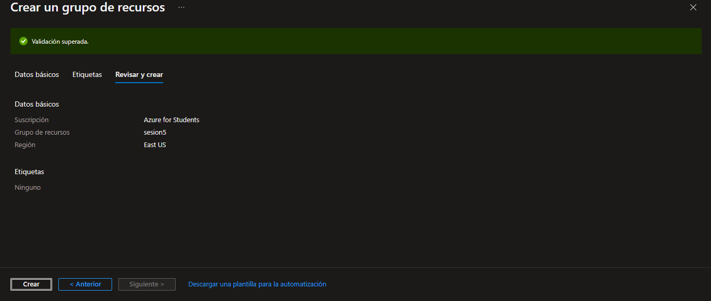
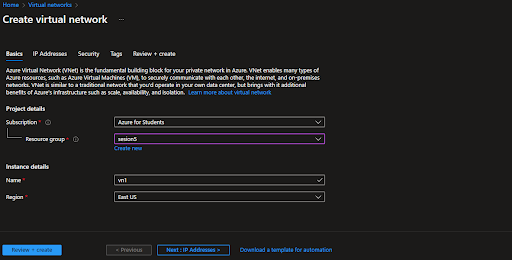
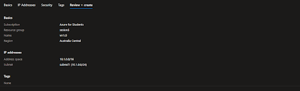
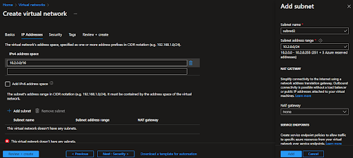
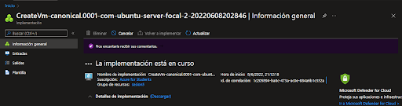
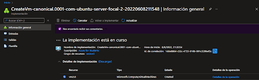
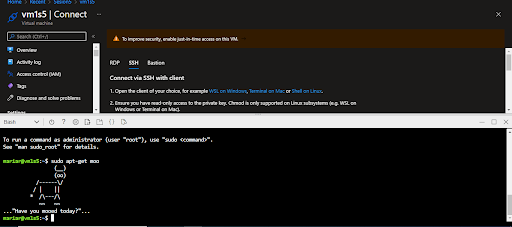
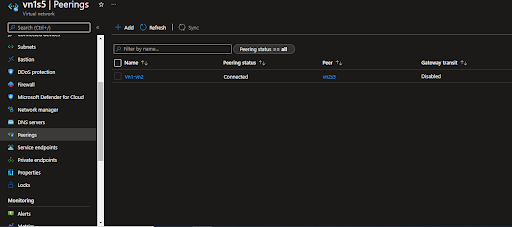
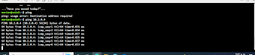

### CREACION DE GRUPO DE RECURSOS

Permite que haya comunicacion entre recursos creados (como maquinas virtuales, aplicaciones web y bases de datos)

## Es de utilidad cuando:

- Se crean y configuran redes virtuales desde el portal de Azure, Azure powershell, Azure CLI, Azure Cloud o plantillas ARM
- Comunicacion entre usuarios de internet, recursos de Azure y recursos locales
- Hay conexion de Redes virtuales
- Filtrar el trafico de redes

## Costos

El costo es variable segun lo que se utilice y por cuanto tiempo esta activo el recurso
Consultar la [calculadora de costos](https://azure.microsoft.com/es-mx/pricing/calculator/)

## Procedimientos

Ingresar a [Portal de Azure](https://portal.azure.com/#home) e iniciar sesion

**Crear un grupo de recursos**

**Crear redes virtuales**

**Crear subred**

Crear una segunda subred 

**Creacion de dos maquinas virtuales**

Conectarlas

Emparejamiento de VN (redes)

Probar el funcionamiento de emparejamiento de las vn a traves de Azure Powershell

